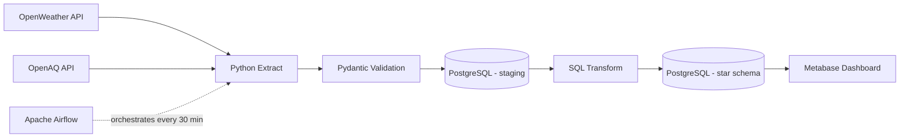
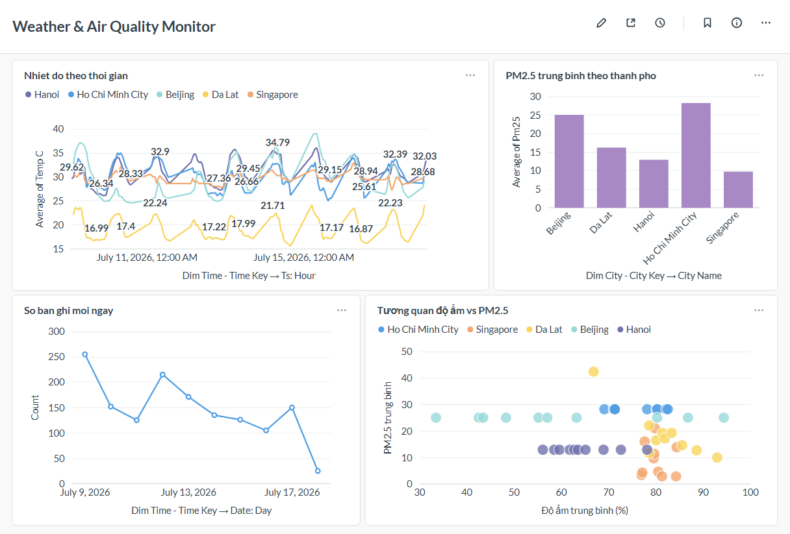

# 🌦️ Weather & Air Quality Data Pipeline

Automated ETL pipeline that collects **weather** (OpenWeather API) and **air quality**
(OpenAQ API) data for Vietnamese and international cities every 30 minutes,
validates it, stores it in a **PostgreSQL star-schema warehouse**, and visualizes
it with **Metabase** — all orchestrated by **Apache Airflow** and fully containerized
with **Docker Compose**.

## Architecture



## Star Schema

- `dw.dim_city` — city dimension
- `dw.dim_time` — time dimension (date, hour, day of week, weekend flag)
- `dw.fact_weather` — temperature, humidity, wind speed
- `dw.fact_air_quality` — PM2.5, PM10, station, data source

## Key Engineering Decisions

- **Idempotent loads**: `ON CONFLICT DO NOTHING` with unique constraints —
  re-running any step never creates duplicates
- **Data validation**: Pydantic schemas reject impossible values
  (temp > 60°C, humidity > 100%, negative PM2.5) before they reach the warehouse
- **Fallback data source**: cities without a nearby OpenAQ ground station
  automatically fall back to OpenWeather's air pollution model
- **Separation of concerns**: Airflow metadata DB and the data warehouse
  run in separate PostgreSQL containers
- **CI**: every push is linted (ruff) and tested (pytest) via GitHub Actions

## Dashboard



## Quick Start

```bash
git clone https://github.com/ngoncovenduoq/data-pipeline-project.git
cd data-pipeline-project
cp .env.example .env        # dien API keys cua ban vao file .env
docker compose up -d --build
```

| Service  | URL                   | Credentials      |
|----------|-----------------------|------------------|
| Airflow  | http://localhost:8080 | admin / admin    |
| Metabase | http://localhost:3000 | set on first run |

## Tech Stack

Python · SQL · PostgreSQL · Apache Airflow · Docker Compose · Metabase ·
Pydantic · pytest · ruff · GitHub Actions

## Project Structure

```
├── dags/           # Airflow DAG (runs every 30 min)
├── etl/            # extract / validate / load / transform modules
├── sql/            # staging DDL + star schema DDL
├── tests/          # unit tests for validation layer
├── .github/        # CI workflow
├── docker-compose.yml
└── Dockerfile
```
